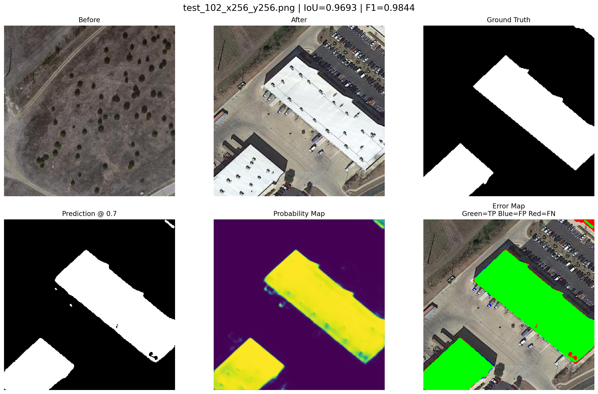
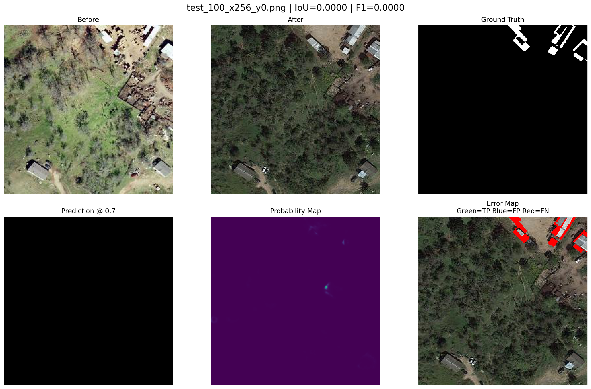
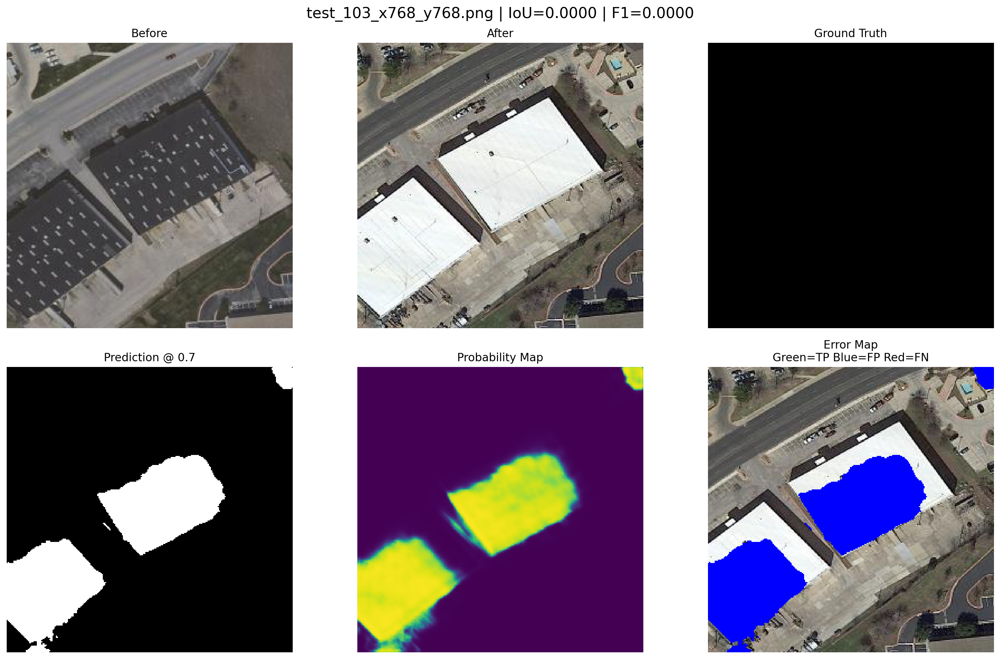

# 🛰️ Satellite Building Change Detection

A deep learning system for detecting building changes between bi-temporal satellite images using a Siamese FC-Siam-Diff architecture trained on the LEVIR-CD dataset.

## 🚀 Project Overview

The system takes two satellite images of the same geographical region captured at different points in time:

**Before Image + After Image → Change Detection Map**

The model learns feature differences between the two images and produces a pixel-level binary change map highlighting areas where building changes are detected.

---

## 🧠 Model Architecture

The project uses a custom Siamese FC-Siam-Diff architecture.

### Pipeline

Before Image
        │
        ▼
┌─────────────────┐
│ Shared Encoder  │
└─────────────────┘
        │
        ▼
Feature Maps

After Image
        │
        ▼
┌─────────────────┐
│ Shared Encoder  │
└─────────────────┘
        │
        ▼
Feature Maps
        │
        ▼
Absolute Feature Difference
        │
        ▼
Decoder + Skip Connections
        │
        ▼
Pixel-wise Change Probability
        │
        ▼
Binary Change Mask

### Encoder

The Siamese encoder uses shared weights for both temporal images:

- ConvBlock: 3 → 64 channels
- ConvBlock: 64 → 128 channels
- ConvBlock: 128 → 256 channels
- ConvBlock: 256 → 512 channels
- Max pooling between encoder stages

Feature differences are calculated using:

`|Feature_A - Feature_B|`

### Decoder

The decoder progressively reconstructs the spatial resolution:

- 768 → 256
- 384 → 128
- 192 → 64
- Final 1×1 convolution → 1-channel change map

Bilinear upsampling and skip connections are used during decoding.

---

## 📊 Dataset

The model was trained and evaluated using the **LEVIR-CD** building change detection dataset.

The dataset contains pairs of high-resolution satellite images captured at different times, together with binary change annotations.

The dataset itself is **not included in this repository**.

---

## 📈 Test Results

### Pixel-level aggregate results

| Metric | Score |
|---|---:|
| IoU | **0.7691** |
| F1 Score | **0.8695** |
| Precision | **0.8809** |
| Recall | **0.8583** |

The selected inference threshold is:

**0.70**

### Full-image macro results

| Metric | Score |
|---|---:|
| Mean IoU | **0.6574** |
| Mean F1 | **0.7495** |
| Mean Precision | **0.7601** |
| Mean Recall | **0.7565** |

Evaluation was performed on 128 full-resolution test images.

---

## 🖼️ Results

### Best Change Detection Case



### Worst Change Detection Case



### False Positive Analysis



---

## 🔍 Inference Pipeline

The deployed inference pipeline accepts two satellite images:

```text
Before Image
     +
After Image
     ↓
256×256 patches
     ↓
Siamese Encoder
     ↓
Feature Difference
     ↓
Decoder
     ↓
Probability Map
     ↓
Threshold = 0.70
     ↓
Binary Change Mask 


Siamese Encoder

The same encoder weights are shared between the Before and After images.

RGB
 ↓
3 → 64
 ↓
64 → 128
 ↓
128 → 256
 ↓
256 → 512

Each encoder stage uses:

3×3 convolution
Batch Normalization
ReLU activation
3×3 convolution
Batch Normalization
ReLU activation

Max pooling is used between encoder stages.

Feature Difference

For each corresponding feature level:

Difference = |Feature_A - Feature_B|

This allows the network to learn spatial differences between the two temporal observations.

Decoder

The decoder progressively reconstructs the spatial resolution using bilinear upsampling and skip connections:

768 → 256
384 → 128
192 → 64
64 → 1

The final 1×1 convolution produces a single-channel change map.

📊 Dataset

The model was trained and evaluated using the LEVIR-CD building change detection dataset.

LEVIR-CD contains pairs of high-resolution satellite images acquired at different times together with binary change annotations.

The dataset itself is not included in this repository.

📈 Test Results
Pixel-Level Aggregate Results
Metric	Score
IoU	0.7691
F1 Score	0.8695
Precision	0.8809
Recall	0.8583
Inference Threshold

0.70

Full 1024×1024 Image Evaluation
Metric	Score
Mean IoU	0.6574
Mean F1	0.7495
Mean Precision	0.7288
Mean Recall	0.7252

Evaluation was performed on 128 full-resolution test images.

🖼️ Results
Best Change Detection Case

Worst Change Detection Case

False Positive Analysis

🔍 Inference Pipeline

The model operates on 256×256 image patches.

For a full 1024×1024 image pair:

1024 × 1024 Before Image
          +
1024 × 1024 After Image
          │
          ▼
      256×256 patches
          │
          ▼
   Siamese CNN Encoder
          │
          ▼
   Feature Differences
          │
          ▼
       Decoder
          │
          ▼
  Patch Probability Maps
          │
          ▼
   Reconstruct Full Image
          │
          ▼
  1024×1024 Probability Map
          │
          ▼
     Threshold = 0.70
          │
          ▼
   Binary Change Mask

The inference pipeline can also process individual 256×256 patches.

🖥️ Streamlit Application

The project includes an interactive Streamlit application.

Users can:

Upload a Before satellite image.
Upload an After satellite image.
Run change detection.
View the predicted change mask.
View the pixel-wise probability map.
View detected changes overlaid on the satellite image.
Download the predicted change mask.
Application Workflow
Before Image
      +
After Image
      ↓
Change Detection Model
      ↓
Probability Map
      ↓
Binary Change Mask
      ↓
Visualization
💻 Run Locally

Clone the repository:

git clone https://github.com/Vijayendra2707/satellite-building-change-detection.git
cd satellite-building-change-detection

Install dependencies:

pip install -r requirements.txt

Run the Streamlit application:

streamlit run app/streamlit_app.py

The application will be available at:

http://localhost:8501
📁 Project Structure
satellite-building-change-detection/
│
├── app/
│   └── streamlit_app.py
│
├── src/
│   ├── model.py
│   └── inference.py
│
├── checkpoints/
│   └── best_model.pth
│
├── results/
│   ├── figures/
│   │   ├── best_change_test_102_x256_y256.png
│   │   ├── worst_change_test_100_x256_y0.png
│   │   └── high_fp_test_103_x768_y768.png
│   │
│   ├── inference/
│   │   └── test_69_change_mask.png
│   │
│   ├── final_metrics.json
│   └── full_image_test_results.csv
│
├── requirements.txt
├── .gitignore
├── .gitattributes
└── README.md
🛠️ Technologies
Python
PyTorch
NumPy
Pillow
Matplotlib
Streamlit
Git
GitHub
Git LFS
🎯 Key Technical Concepts
Siamese neural networks
Bi-temporal satellite image analysis
Building change detection
Pixel-level binary segmentation
Feature difference learning
Encoder-decoder architecture
Skip connections
Patch-based inference
Full-resolution image reconstruction
Probability thresholding
IoU
F1 Score
Precision
Recall
🔬 Model Evaluation

The system was evaluated at both patch and full-image levels.

Patch-level evaluation was used to assess individual 256×256 predictions, while full-image evaluation reconstructed predictions for the original 1024×1024 satellite images.

The final pixel-level aggregate test results were:

IoU       : 0.7691
F1        : 0.8695
Precision : 0.8809
Recall    : 0.8583

The system also includes analysis of:

Best change detection cases
Worst change detection cases
False-positive cases
No-change images
🚧 Limitations

The model is specifically trained for building change detection using the LEVIR-CD dataset.

It is not a general-purpose satellite object detector and does not classify changes into categories such as:

Roads
Forests
Rivers
Vehicles
Other land-cover classes

The model predicts whether pixels correspond to learned building-change patterns.

🔮 Future Improvements

Potential improvements include:

Improving performance on difficult change cases
Reducing false-positive predictions
Experimenting with stronger data augmentation strategies
Adding post-processing for small isolated predictions
Evaluating additional change detection architectures
Testing additional satellite change detection datasets
GPU-backed deployment
Model optimization for faster inference
📌 Project Highlights
Custom Siamese CNN architecture
Shared-weight bi-temporal feature extraction
Multi-scale feature difference learning
Encoder-decoder segmentation architecture
Patch-based full-resolution inference
Interactive Streamlit application
Quantitative evaluation using IoU, F1, Precision and Recall
Reproducible inference pipeline
Git LFS model checkpoint management
📄 License

This project is intended for educational and portfolio purposes.
'''
